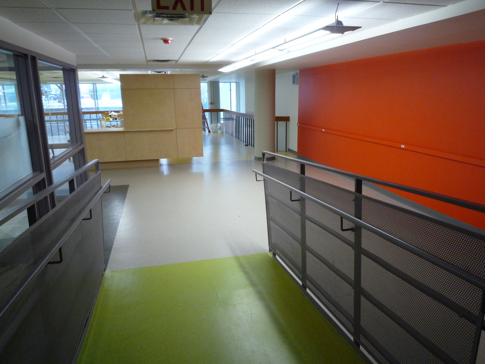
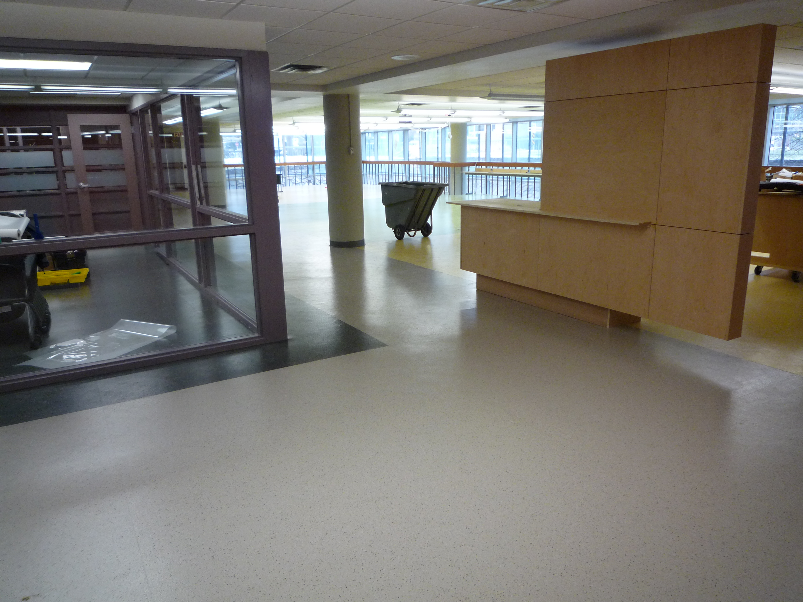
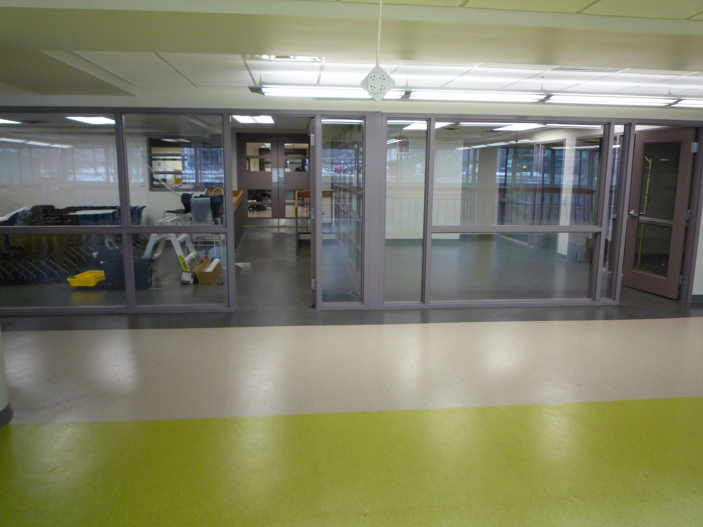

!SLIDE
# A Digital Scholarship Centre? What is that!? #

!SLIDE bullets
# Origins and Motivations

* gift from Lewis and Ruth Sherman Foundation
* ideal faculty collaborator
* creating a "McMaster model"
* supporting research through direct collaboration
* utilizing all of the expertise in the organization

!SLIDE bullets
# Current state of affairs #

* opening in mere weeks (mid-February?)
* student competition to design entryway multimedia gallery
* creating policy, scope, guiding documents
* several projects already running

!SLIDE center
# opening in mere weeks (mid-February?)
student competition to design entryway multimedia gallery
creating policy, scope, guiding documents
several projects already running#

!SLIDE

!SLIDE

!SLIDE

!SLIDE

!SLIDE

!SLIDE

!SLIDE

!SLIDE bullets
# Who are we? #

* Administrative Director
* Digital Scholarship Librarian - John Fink
* Digital Preservation Librarian, Repository Architect, and Digitization Coordinator - Nick Ruest
* Programmer - Matt McCollow (second position open)
* Postdoc - Jason Brodeur

!SLIDE bullets
# Governance  - Original idea #

* two directors - academic & administrative
* academic director = faculty member
* not easy to replace

!SLIDE bullets
# Governance - Current iteration #

* administrative director
* advisory board with multiple faculty members + others

!SLIDE bullets
# Audience #

* faculty, graduate students
* occasional advanced undergraduate w/ specific research needs
* the broader DH/DS community

!SLIDE bullets
# relationship building #

* library staff - welcome and included
* outreach to faculty and graduate students
* grad students key - get them, and rest follow
* tap into existing DH/DS networks - centerNet, ADHO, etc.
* Canadian/provincial/regional partners
* symposia, training, lectures - lots of events

!SLIDE bullets
# Challenges *

* why DS, not DH? - defining the scope
* knowing what people want
* not aiming too high, not aiming too low

!SLIDE
# All our ideas #

!SLIDE

allourideas.org/libraryds/

!SLIDE bullets
# Opportunities #

* get serious about substantive research support
* coordinate many new library initiatives
* research popularization
* project management education
