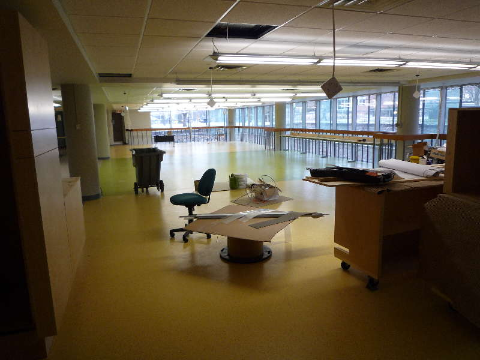
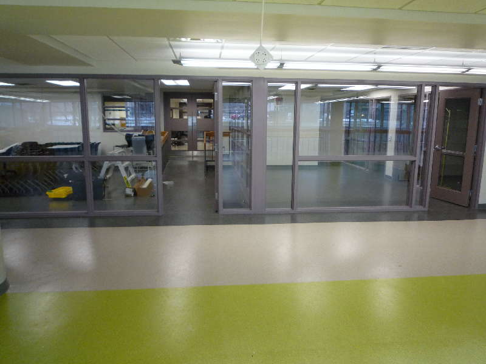
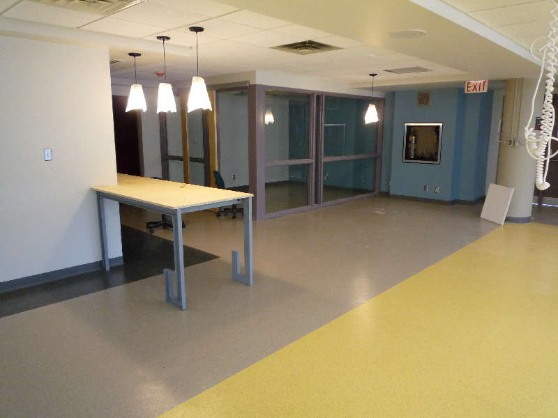
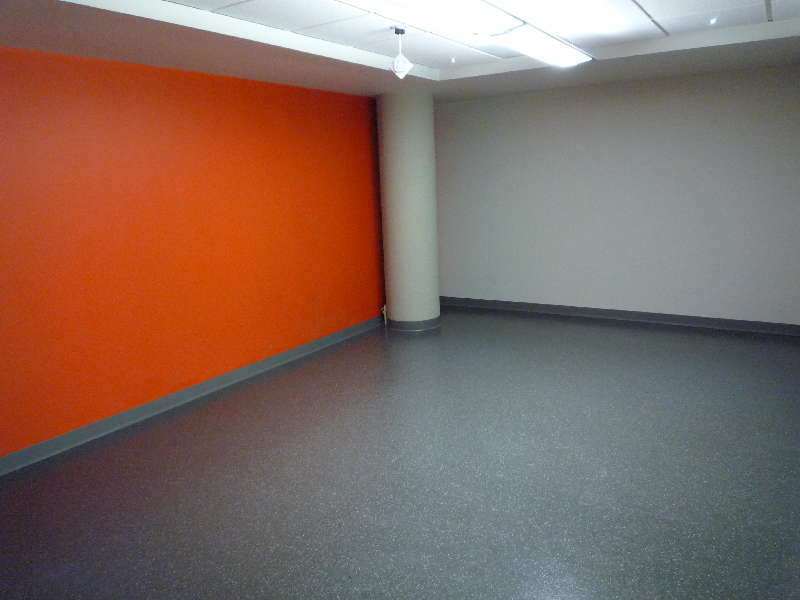
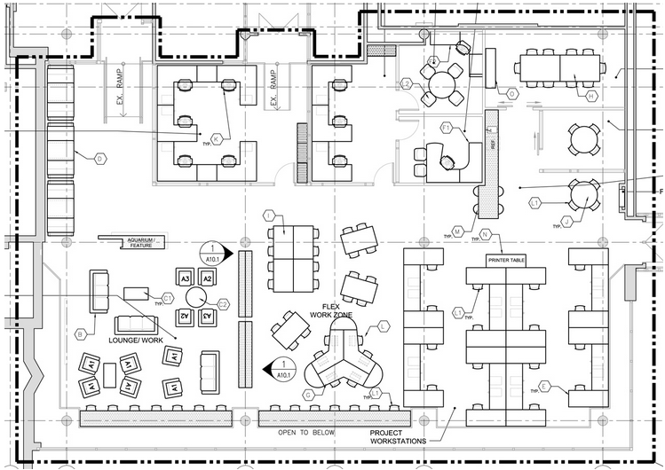
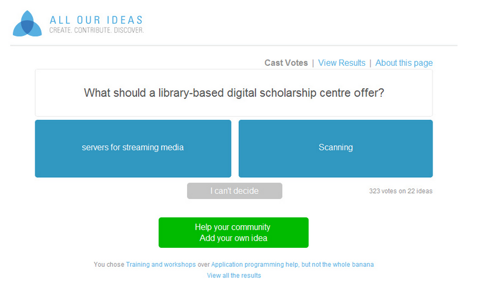
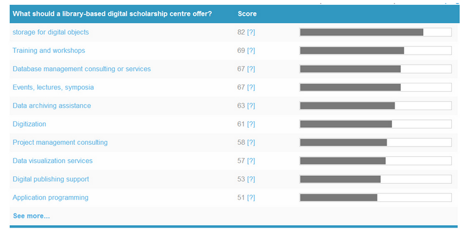

!SLIDES center
# A Digital Scholarship Centre? What is that!? #

!SLIDE
# Dale Askey #
## AUL Library & Learning Technologies ##

!SLIDE
# Origins and Motivations #
 
  * gift from Lewis and Ruth Sherman Foundation
  * ideal faculty collaborator
  * creating a "McMaster model"
  * supporting research through direct collaboration
  * utilizing all of the expertise in the organization

!SLIDE
# Current state of affairs #

  * opening in mere weeks (mid-February?)
  * student competition to design entryway multimedia gallery
  * creating policy, scope, guiding documents
  * several projects already running

!SLIDE

  * opening in mere weeks (mid-February?)
  * student competition to design entryway multimedia gallery
  * creating policy, scope, guiding documents
  * several projects already running

!SLIDE center

!SLIDE center

!SLIDE center

!SLIDE center

!SLIDE center

!SLIDE center

!SLIDE center

!SLIDE
# Who are we? #

  * Administrative Director
  * Digital Scholarship Librarian - John Fink
  * Digital Preservation Librarian, etc, etc - Nick Ruest
  * Programmer - Matt McCollow (second position open)
  * Postdoc - Jason Brodeur

!SLIDE
# Governance #
## Original idea ##

  * two directors - academic & administrative
  * academic director = faculty member
  * not easy to replace

!SLIDE
# Governance #
## Current iteration ##

  * administrative director
  * advisory board with multiple faculty members + others

!SLIDE
# Audience #

  * faculty, graduate students
  * occasional advanced undergraduate w/ specific research needs
  * the broader DH/DS community

!SLIDE
# Relationship building #

  * library staff - welcome and included
  * outreach to faculty and graduate students
  * grad students key - get them, and rest follow

!SLIDE
# Relationship building #

  * tap into existing DH/DS networks - centerNet, ADHO, etc.
  * Canadian/provincial/regional partners
  * symposia, training, lectures - lots of events

!SLIDE
# Challenges #

  * why DS, not DH? - defining the scope
  * knowing what people want
  * not aiming too high, not aiming too low

!SLIDE center
# All our ideas #

!SLIDE center

allourideas.org/libraryds/

!SLIDE
# Opportunities #

  * get serious about substantive research support
  * coordinate many new library initiatives
  * research popularization
  * project management education
