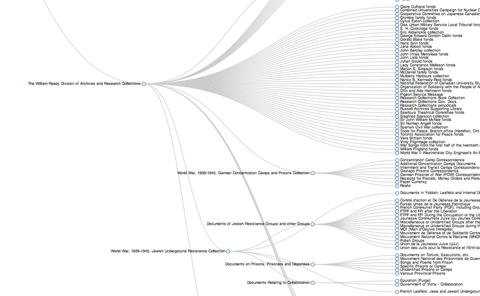

!SLIDE 
# A Digital Scholarship Centre? What is that!? #

!SLIDE
# THIS IS WHERE DALE'S SLIDES START #

!SLIDE
# THIS IS WHERE JOHN'S SLIDES START #

!SLIDE bullets incremental
# Computing Infrastructure #
* Heavy reliance on VMs
* Keep administration agile

!SLIDE bullets incremental
# Right now this means #
* KVM for VMs
* .deb based Linux distributions
* sysadmin through cherry-pick or clusterssh

!SLIDE bullets incremental
# This is not terribly scalable #

!SLIDE bullets incremental
# grad and faculty relationship #
* Concentrate on underserved populations
* At Mac this means humanities grad students, humanities in general
 
!SLIDE
# sla writing #
* Yeah, I should do this at some point. ;)

!SLIDE
# services #
* Physical services
* Virtual services

!SLIDE
# where do we stop or start with a project? #

!SLIDE
# github #
* Already a site for a lot of DH development
* Scholarslab, CHNM
* Visibility!

!SLIDE
# version control evangelism #

!SLIDE
# project management education #

!SLIDE
# THIS IS WHERE NICK'S SLIDES START #

!SLIDE center

I am an odd duck.

!SLIDE center

I don't really fit in anywhere, but I fit in everywhere?

.notes A position like mine does not fit perfectly into any single traditional library department. I like to joke that I have a lot of feet since I have a foot in nearly every department. I have a natural connection to IT give the tech behind most of what I do. But, at its heart, digital collections/preservation is just another form of collection development. 

.notes I've bounced around a few departments over my time at McMaster, but I think I have finally found a home in the centre. It is the best possible scenario at this point.

!SLIDE bullets incremental
# INFRASTRUCTURE #

* Digitization
* Digital Respository
* Digital Preservation

.notes one of my standard phases at work is INFRASTRUCTURE! Given that when I started at Mac there was nearly zero infrastructure for digitization or repository structure, we had to basically start from scratch. Over the last few years we have built some decent infrastructure for Digitization. We have a hosted institutional repository from Bepress (DigitalCommons) and we have the begun the work of building a solid local digital repository with Fedora Commons and Islandora. We're also slowly working on policy and best practices for digital preservation. 

!SLIDE bullets incremental
# Digitization #

* Local projects
  * Jewish Underground Resistance collection
  * World War, 1939-1945, German Concentration Camps and Prisons collection
  * Peace and War in the 20th Century
  * Historical Perspectives on Canadian Publishing
  * Masters and PhD theses
  * Book scanning

.notes Digitization is one thing we are *really* good at. We have digitized an insane amount of materials over the last few years. But, the problem is a lot of it isn't publically available. This should begin to change very soon with the new digital repository. These are some local projects we have completed or working on at the moment. talk about each project briefly.

!SLIDE bullets incremental
# Digitization #

* Partnerships
  * Adam Matthews
    * World War I collections (~20k objects)
  * Gale
    * Holocaust and Jewish Resistance materials (~26k objects)
    * Pamphlet collections (starts in Febuary 2012

.notes besides or local projects, we have partnered with a couple of vendors to digitize entire collections. Normally hearing the word vendor partnership is something I would immediately scoff at, but these partnerships are not too bad when you think about them. talk about each partnership briefly.
        
!SLIDE bullets incremental
# Digitization #

* Challenges
  * Growing fast
  * Infrastructure
  * Public
  * Repository
  * Digital Preservation
  * Staffing

!SLIDE bullets incremental
# Digital Repository #

!SLIDE center

!SLIDE center

check out the infograph here: http://ruebot.net/macrepo-visual/index.html

!SLIDE bullets incremental
# Digitial Preservation #

* Documentation
  * Documentation
    * Documenation
* Policy
  * Policy
    * Policy
* Technical stuff
  * Infrastructure
  * Code
* THE COMMUNITY IS YOUR BEST FRIEND!

!SLIDE center
# Support #

!SLIDE bullets incremental
# What can the repo do or provide? #

* APIs
* Text and data to analyze
* Harvesting
  
!SLIDE bullets incremental
#Education & Knowledge Sharing #

* Harvesting
* Metadata
* Best practices
* Project management
* Version control
